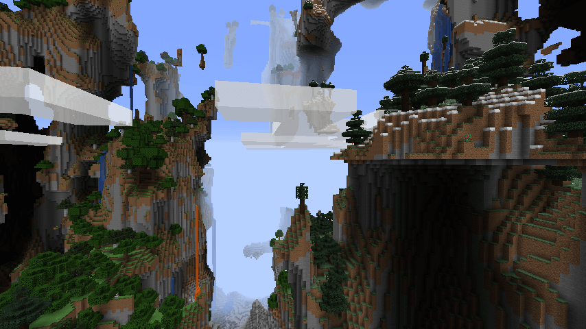

# Dough

Minecraft 1.13, 1.14 and Minecraft 1.15 lacked the "Customized" world type. This example plugin shows how one could add it back using [WorldGeneratorApi](https://github.com/rutgerkok/WorldGeneratorApi). This plugin implements all terrain shape settings of the old "Customized" world type (Minecraft 1.8 - 1.12), and still works on newer versions of Minecraft.

* [Downloads](https://github.com/rutgerkok/Dough/releases)
* [Installation instructions](https://github.com/rutgerkok/Dough/wiki/Installation)
* [The settings explained](https://github.com/rutgerkok/Dough/wiki/Configuration)
* [Conversion from TerrainControl](https://github.com/rutgerkok/Dough/wiki/TerrainControl)
* [Conversion from Minecraft 1.12 Customized settings](https://github.com/rutgerkok/Dough/wiki/Customized)
